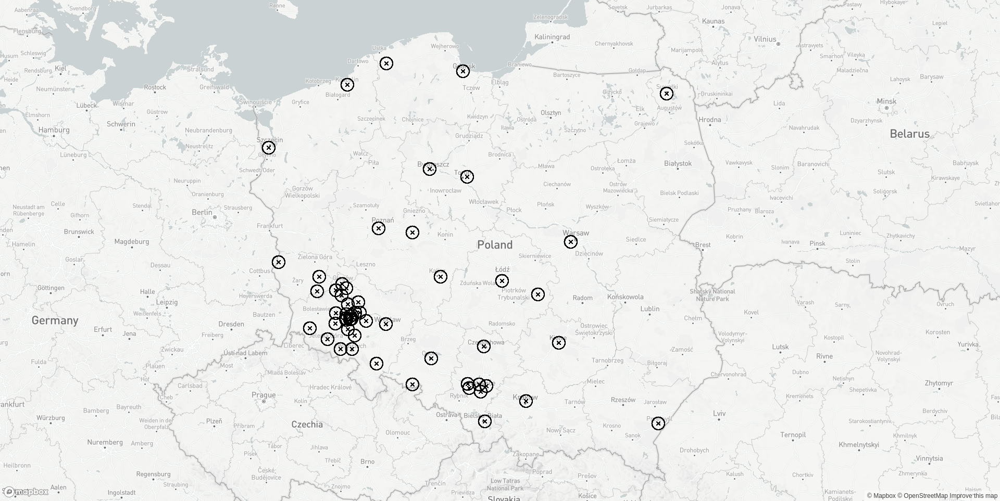

## Program
Powyższy program jest prostą przykładową aplikacją do wstępnej analizy danych z bazy TERYT. Jest wykorzystywany jako podstawa projektowa na zajęciach "Programowanie dla inżynierów" dla kierunku Inżynieria produkcji i logistyki na Wydziale Nauk Technicznych i Ekonomicznych Państwowej Wyższej Szkoły Zawodowej im. Witelona w Legnicy.

### Wymagania
* Python 3
* opcjonalnie token [Mapbox](https://www.mapbox.com/) do generowania map

### Uruchomienie
Dostępne są dwa tryby uruchomienia:
* `python3 main.py phrase` - wypisuje wszystkie lokacje pasujące do podanej `phrase`;
* `python3 main.py phrase token` - wypisuje wszystkie lokacje pasujące do podanej `phrase` oraz rysuje je na mapie.

W przypadku uruchomienia z tokenem Mapboksa, wynik znajdzie się w folderze `www/index.html`.

### Krok po kroku
W pliku `main.py` znajduje się zestaw instrukcji, które zostaną pokrótce opisane poniżej:

```python
searched_street = get_searched_phrase(argv)
mapbox = get_mapbox(argv)
```
Na podstawie podanych argumentów budowane są wewnętrzne zmienne przechowujące odpowiednie informację o wyszukiwanej frazie oraz obiekcie mapy. Jeżeli nie zostały podane żadne argumenty, program nie uruchomi się poprawnie.

Przy podaniu tylko jednego argumentu zostanie przeprowadzenie przeszukanie zbiorów i wypisanie ich w konsoli na podstawie podanego argumentu.

Przy podaniu dwóch argumentów, drugi zostanie potraktowany jako token Mapboksa.

```python
cities = Cities("data/SIMC_Urzedowy_2021-10-09.csv")
streets = Streets("data/ULIC_Adresowy_2021-10-09.csv", cities)
```
Następnie inicjalizowane są dwa repozytoria: miast na podstawie pliku oraz ulic na podstawie pliku i repozytorium miast. 

```python
counter = 0
found_streets = streets.find_by_street_name(searched_street)

for street in found_streets:
    phrase = str(street.city) + ": " + street.get_full_name()
    print(phrase)
    counter = counter + 1

    if mapbox:
        coordinate = mapbox.add_coordinates_for_phrase(phrase)

print(str(counter) + " streets were found.")
```
Metoda `find_by_street_name` zwraca znalezione ulice, które w pętli `for` są wypisywane oraz podliczane. Jeżeli właczono tryb generowania mapy, zbierane są ich koordynaty z API Mapboksa.

```python
if mapbox:
    mapbox.prepare_map(searched_street)
```

Na koniec generowana jest mapa do pliku `www/index.html`. Podgląd wszystkich funkcji znajduje się w plikach w katalogu `src`.

### Przykład
Poniższy przykład pokazuje jak uruchomić program dla wyszukania wszystkich ulic mających w nazwie człon "Legnic" oraz narysować je na mapie:

```
krzysztof@optiplex:~/dev/pdi python3 main.py "Legnic" pk.ey(...)

Olszyna: ul. Legnicka
Lubin: ul. Legnicka
Legnica: Rondo Bitwy Legnickiej 1241 r.
Ścinawa: ul. Legnicka
Głogów: ul. Legnicka
Lubiąż: ul. Legnicka
Wrocław-Fabryczna: ul. Legnicka
Jawor: ul. Legnicka
Kamienna Góra: ul. Legnicka
Wrocław-Stare Miasto: ul. Legnicka
Grębocice: ul. Legnicka
Polkowice: ul. Legnicka
Chojnów: ul. Legnicka
Radwanice: ul. Legnicka
Środa Śląska: ul. Legnicka
Bydgoszcz: ul. Legnicka
Ząbkowice Śląskie: ul. Legnicka
Strzegom: ul. Legnicka
Toruń: ul. Legnicka
Złotoryja: ul. Legnicka
Jelenia Góra: ul. Legnicka
Kożuchów: ul. Legnicka
Gubin: ul. Legnicka
Kraków-Krowodrza: ul. Legnicka
Inowłódz: ul. Legnicka
Szprotawa: ul. Legnicka
Łódź-Polesie: ul. Legnicka
Ursus: ul. Legnicka
Prudnik: ul. Legnicka
Opole: ul. Legnicka
Słupsk: ul. Legnicka
Przemyśl: ul. Legnicka
Gdańsk: ul. Legnicka
Suwałki: ul. Legnicka
Chorzów: ul. Legnicka
Częstochowa: ul. Legnicka
Gliwice: ul. Legnicka
Sosnowiec: ul. Legnicka
Katowice: ul. Legnicka
Zabrze: ul. Legnicka
Bielsko-Biała: ul. Legnicka
Bytom: ul. Legnicka
Kielce: ul. Legnicka
Września: ul. Legnicka
Kalisz: ul. Legnicka
Poznań-Grunwald: ul. Legnicka
Koszalin: ul. Legnicka
Szczecin: ul. Legnicka
Wałbrzych: ul. Legnicka
Legnica: ul. Piastów Legnickich
Włochy: ul. Legnicka
Koskowice: ul. Legnicka
Grzybiany: ul. Legnicka
Ziemnice: ul. Legnicka
Kunice: ul. Legnicka
Spalona: ul. Legnicka
Rzeszotary: ul. Legnicka
Prochowice: ul. Legnicka

58 streets were found.
Index file generated.
```



## Zadanie dla studentów
Każda grupa - bazując na powyższym programie lub nie - powinna w dowolny sposób zrealizować następujące funkcjonalności:
* znajdowanie najpopularniejszej nazwy ulicy per województwo (warto tutaj spojrzeć na to jak zapisane są dane w pliku `data/ULIC_Adresowy_2021-10-09.csv`);
* porównanie "popularności" miast, czyli wskazanie jakiej ulicy jest w kraju więcej (np. "Legnicka" a "Wałbrzyska");

oraz sprawdzić:
* ile spośród 100 najpopularniejszych nazw ulic pochodzi od nazwisk, zawodów, roślin lub innych kategorii?
* jak często może się zdarzyć, że w jednym mieści znajdują się dwie ulice o prawie takiej samej nazwie (przykładowo ul. Zygmunta Wróblewskiego i pl. Walerego Wróblewskiego we Wrocławiu)?

a także zaproponować trzy własne tematy do opracowania.

## Źródła
Pliki TERYT zostały pobrane 9 października 2021 roku z poniższego adresu:
* https://eteryt.stat.gov.pl/eTeryt/rejestr_teryt/udostepnianie_danych/baza_teryt/uzytkownicy_indywidualni/pobieranie/pliki_pelne.aspx?contrast=default